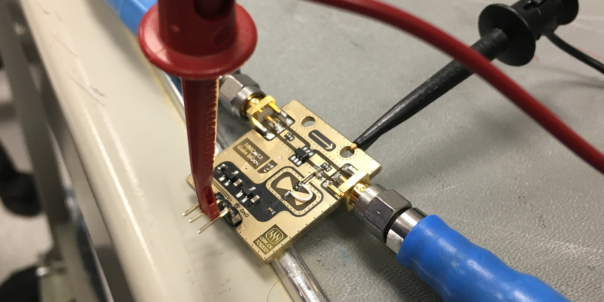

 

# Overview 

**CS Gain Block (CSGB) is a very economical [HMC313](https://www.analog.com/en/products/hmc313.html) based RF amplifier module** with on board power regulation and a nice "cutting edge RF black magic" aesthetic thanks to the inverted soldermask. 

It has about 10 to 15 dB of gain, and is good from near DC to just a bit over 6 GHz. (These are figures from characterization with VNA, see more details below.) 

We developed this as part of our exploration into radar imaging, [Project Mashiro](https://github.com/criterionsignalworks/mashiro) - I ~~supposedly~~ broke an LNA evaluation board lent to us by Tektronix, which is why I'm making sure to include some protection circuitry. 

 

# Realization 

The circuit board is designed using Altium. As I'm too lazy to find a clever way to get this inverted soldermask effect, so I used manually placed polygons and regions. Tedious, yes, but it seems to work. 

For the on board voltage regulation circutiry, we reused the LDO design with ferrite bead and reverse blocking P channel MOSFET from our (WIP) development platform for STM8, [CS Coda](https://csw.cx/assets/projects/coda/coda-7-pre-asy-black.jpg). (Adapted to 5V, of course.) The supporting passives for the MMIC amplifier (just a bias tee) were derived from the [datasheet](https://www.analog.com/media/en/technical-documentation/data-sheets/hmc313.pdf). We chose 0402 components for the DC blocking capacitors and RF blocking inductors due to our assembly capabilities and performance. 

We did a little microstrip filter design with the bowtie capacitor to ground - it mainly just look pretty, it doesn't seem to contribute too much to the performance of the device. 

<!--
 
*Please excuse some weird layout choices in the sketch, that was just brainstorming. Too bad a mistake is now set in ~~stone~~ copper:*
-->

# Errata 

This is my first microstrip PCB design involving slightly more complex design considerations (though indeed it's pretty much just a simple breakout for HMC313) 

I made a mistake with the placement of the bias tee - the RF blocking inductor should ideally be right on the transmission line. Instead, I cleverly placed a long track that acts as an open stub at the frequencies we're dealing with. This acts as a band reject filter centering somewhere around 3 GHz. 

To fix this, a little modifications is required: cut the bias track close to the transmission line, put an inductor across there with an accompanying capacitor to ground. The exact values don't seem to matter too much, same 1 nH inductors and something like 1 nF should work. Keep the quality factor of the components in mind. 

This problem actually exists in the [official evaluation board](https://www.analog.com/en/design-center/evaluation-hardware-and-software/evaluation-boards-kits/eval-hmc313.html) designed by Hitite (now AD), which costs like $248.85 USD. The gain at near 6 GHz approaches -20 dB, rendering it entirely useless within the specified range! 

We discovered this issue with help from Tektronix, who provided us access to a VNA from their Mainstream lab. *thanks!* 

 

# Performance 

Again thanks to kind folks at Tektronix, we were able characterize our design with the VNA. Our (revised) design performs better than the Hitite/AD reference board. 

The image above shows our testing setup - we have a bench power supply and semi-calibrated low loss VNA cables connected to the SMA connectors. Standard stuff. 

Here is the frequency response of the Hitite evaluation board - notice the band reject effect at 6.5 GHz and gain below 10 dB at the 4.5 GHz mark. This is not supposed to happen! 

 

And this is the frequency responce of our revised gain block design - no issues even going a bit past the specifications. We might be rolling off a bit too early on the low frequency end, which can be easily fixed with bigger capacitance values for the DC blocking ceramics. Our gain is a bit lower across the board, being 10 dB instead of the peak 15 dB on the eval board. 

*Could this be due to more lossy materials? We're using FR-4 here instead of some fancy Rogers stuff.* Perhaps consider using blocking inductor with higher value? 

 

Without the modification we specified earlier, this is what it looks like - there's a notch reject going on at 3 GHz, as well as a harmonic looking thing a bit higher up, again due to the open stub caused by mistake with layout. *~~Dame desu~~ This is no good!* 

 

## JLCPCB 

[JLCPCB](https://jlcpcb.com/RAT) were able to help us fabricate these boards. We've worked with them for all of our projects so far and their flexibility and performance really helps realizing compact and high performing designs! 

We were able to get some close up images with a microscope, showing crisp soldermask and copper deposition: 

 
 

I'm a big fan of how the board looks. Really makes me feel like some fancy RF engineer. 

## License 

This work is licensed under a [Creative Commons Attribution-NonCommercial-ShareAlike 4.0 International License][cc-by-nc-sa]. 

 

[cc-by-nc-sa]: http://creativecommons.org/licenses/by-nc-sa/4.0/ 
